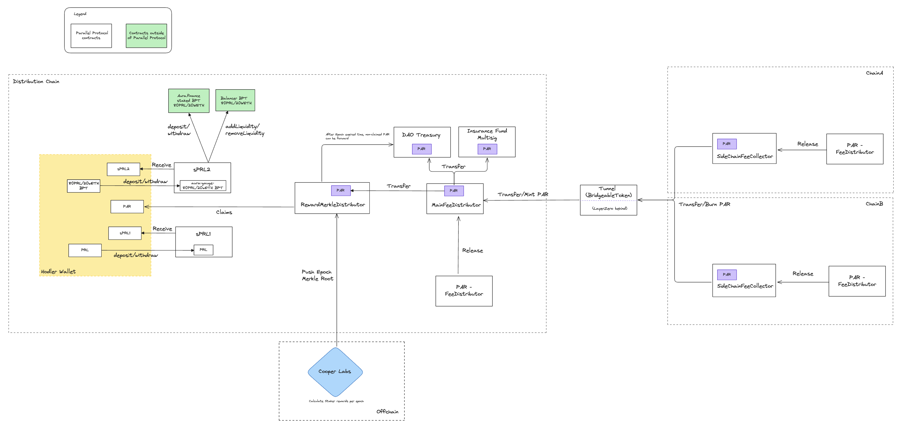

# Parallel Tokenomics

## 1. Overview

The Parallel Tokenomics is a set of contracts that allows :

- to run dutch auctions for getting a single fee token and that will be sent to the fee distributor deployed on that
  chain (Auctioneer)
- to send the fees to the main fee distributor on the destination chain (SideChainFeeDistributor)
- to distribute fees generated by the protocol to the listed fee receivers (MainFeeDistributor)
- users to stake their PRL tokens to earn rewards either in single staking (sPRL1) or in a 80PRL/20WETH balancer pool
  (BPT) that is deposited into aura.finance (sPRL2).
- distribute rewards to sPRL1/sPRL2 users using off-chain calculation and merkle proofs (RewardMerkleDistributor)

See below the high level architecture of the protocol:

## 2. Security Point

- OpenZeppelin AccessManged dependency is used to manage the access to the contracts.
- Emergency pause mechanisms are implemented in the contracts using the `pause()` and `unpause()` functions from the
  OpenZeppelin library.
- OpenZeppelin ReentrancyGuard is used to prevent reentrancy attacks.
- Slippage protection on deposit/withdraw that will go through Balancer during sPRL2 flow.

## 3. Key Operation Flows

### 3.1 Auction Flow

- At start the deployer will set the initial price, duration of the auction, the price multiplier and the start time of
  the first auction.
- At the start time, the auction will be open and the total price expected to be paid will decrease until the end of the
  auction duration.
- When someone buys the assets, the price will be updated using the price multiplier, the current paid price and the
  minimum price.
- The token used to pay for the assets will be sent to the payment receiver (SideChainFeeCollertor or MainFeeDistributor
  depending on the chain).

### 3.2 Staking Flow

This section contains the flows related to the staking part of the protocol.

#### 3.2.1 sPRL1 Flow

##### 3.2.1.1 sPRL1 Deposit

- Transfer PRL tokens to the sPRL1 contract
- Mint sPRL1 tokens to the user equivalent to the amount of PRL tokens transferred

##### 3.2.1.2 sPRL1 Request Withdraw

- Burn the amount of sPRL1 tokens that the user wants to withdraw
- Set the unlocking time for this request

##### 3.2.1.3 sPRL1 Withdraw

- Calculate the penalty based on the time left before the unlocking time.
- Send the PRL tokens to the user
- mint sPRL1 tokens to the fee receiver equal to the amount slashed from the penalty.

#### 3.2.2 sPRL2 Flow

This section contains the flows related to the sPRL2 contract.

##### 3.2.2.1 sPRL2 Deposit PRL/WETH or PRL/ETH

- Transfer PRL/WETH or PRL/ETH to the sPRL2 contract
- Deposit ETH to WETH if needed
- Add PRL/WETH liquidity into the Balancer pool (80PRL/20WETH)
- Receive BPT tokens
- Stake BPT tokens in Aura
- Receive Aura BPT lp tokens
- mint sPRL2 tokens to the user equivalent to the amount of Aura BPT lp tokens received

##### 3.2.2.1 sPRL2 Deposit Aura BPT 80PRL/20WETH

- Transfer PRL/WETH or PRL/ETH to the sPRL2 contract
- Mint sPRL2 tokens to the user equivalent to the amount of PRL/WETH or PRL/ETH transferred

##### 3.2.2.2 sPRL2 Request Withdraw

- Burn the amount of sPRL2 tokens that the user wants to withdraw
- Set the unlocking time for this request

##### 3.2.2.3 sPRL2 Withdraw PRL/ETH or PRL/WETH

- Calculate the penalty based on the time left before the unlocking time.
- Withdraw the amount of Aura BPT lp tokens that the can withdraw after penalties from the Aura pool
- Receive Balancer BPT tokens from Aura
- Withdraw the amount of PRL/WETH from the Balancer pool
- Send the PRL/WETH to the user or PRL/ETH to the user
- Mint sPRL2 tokens to the fee receiver equal to the amount slashed from the penalty.

##### 3.2.2.3 sPRL2 Withdraw Aura BPT 80PRL/20WETH

- Calculate the penalty based on the time left before the unlocking time.
- Send the Aura BPT lp tokens to the user
- Send the Aura BPT lp penalty to the fee receiver

### 3.3 Reward Distribution Flow

- RewardMerkleDistributor will receive the fees from the MainFeeDistributor at any time.
- Using off-chain events and calculations, the protocol retrieve the total amount received during a specific period.
- Protocol will generate a merkle root based on the total amount received and the amount of rewards that will be
  distributed to the users.
- The merkle root will be updated in the RewardMerkleDistributor contract.
- Users will be able to claim their rewards using the merkle proof.

## 4. Contracts

### 4.1 Fees

This section contains the contracts related to the fees distribution and collection.

#### 4.1.1 [FeeCollectorCore](../contracts/fees/FeeCollectorCore.sol)

This abstract contract is used to handle the common logic between the MainFeeDistributor and the SideChainFeeDistributor
contracts. All the functions are restricted to the AccessManager.

**function details**:

- `emergencyRescue(address _token, address _to, uint256 _amount)` | **Restricted** : Allow to rescue tokens from the
  contract.
- `pause()` | **Restricted** : Allow to pause the contract.
- `unpause()` | **Restricted** : Allow to unpause the contract.

#### 4.1.2 [MainFeeDistributor](../contracts/fees/MainFeeDistributor.sol)

This contract is deployed on the chain that distributes the fees to users and fees receivers. Inherits from
FeeCollectorCore. It will receive the fee token bridge from the SideChainFeeDistributor and distribute it to the fee
receivers. As Parallel Tunnel can transfer lz-XXX instead of the fee token if credit limits are reached, this contract
can call the bridgeableToken contract to swap the lz-XXX to the fee token.

**function details**:

- `release()` | **Permissionless** : Allow to release the fees to the fee receivers.
- `swapLzToken()` | **Permissionless** : Will swap as much lz-XXX as possible to the fee token by calling the
  bridgeableToken contract.
- `updateBridgeableToken(address _newBridgeableToken)`| **Restricted** : Allow to update the bridgeable token contract
  (parallel tunnel).
- `updateFeeReceivers(address[] memory _feeReceivers, uint256[] memory _shares)` | **Restricted** : Allow to update the
  list of the fee receivers and their shares.

#### 4.1.3 [SideChainFeeDistributor](../contracts/fees/SideChainFeeDistributor.sol)

This contract is deployed on side chains and is used to distribute the fees to the MainFeeDistributor by bridging them
using Parallel Tunnel. Inherits from FeeCollectorCore.

**function details**:

- `release()` | **Permissionless** : Will create a LayerZero message and transfer the balance of fee token owned by the
  contract to the BridgeableToken contract.

#### 4.1.4 [Auctioneer](../contracts/fees/Auctioneer.sol)

This contract is used to run dutch auctions for getting a single fee token and that will be sent to the fee distributor
deployed on that chain. Inspired by [FeeFlowController](https://github.com/euler-xyz/fee-flow) the auction using a init
price and duration that will be used to calculate the price of the auction.

**function details**:

- `buy(address[] calldata _assets, address _assetsReceiver, uint256 _epochId, uint256 _maxPaymentTokenAmount)` |
  **Permissionless** : Allow to buy assets by transferring payment tokens and receiving the assets.
- `emergencyRescue(address _token, address _to, uint256 _amount)` | **Restricted** : Allow to rescue tokens from the
  contract.
- `updatePaymentToken(address _newPaymentToken)` | **Restricted** : Allow change the payment token expected to receive.
- `updatePaymentReceiver(address _newPaymentReceiver)` | **Restricted** : Allow change the destination receiver of the
  fee token.
- `updateEpochSettings(uint256 _epochDuration, uint256 _initPrice, uint256 _priceMultiplier, uint256 _minInitPrice)` |
  **Restricted** : Allow change the epoch settings.
- `pause()` | **Restricted** : Allow to pause the contract.
- `unpause()` | **Restricted** : Allow to unpause the contract.

### 4.2 Staking

This section contains the contracts related to the staking part of the protocol.

#### 4.2.1 [TimeLockPenaltyERC20](../contracts/sPRL/TimeLockPenaltyERC20.sol)

This abstract contract is used to handle commun logic between sPRL1 and sPRL2. The main feature of it, it's to deposit a
specific ERC20 and apply a lock time duration for withdrawals. Users is also able to withdraw their tokens before the
lock time but will be penalized by a penalty fee on the withdraw amount that is calculated based on the time left before
the lock time.

**Parameters**:

- Lock Duration: Configurable
- Penalty Start Percentage: Configurable
- Penalty Decay: Linear

**function details**:

- `deposit(uint256 _amount)` | **Permissionless** : Allow to deposit the underlying ERC20 and mint the equivalent amount
  of tokens.
- `depositWithPermit(uint256 _amount, uint256 _deadline, uint8 _v, bytes32 _r, bytes32 _s)` | **Permissionless** : Allow
  to deposit the underlying ERC20 using ERC20Permit and mint the equivalent amount of tokens.
- `withdraw(uint256[] calldata _ids)` | **Permissionless** : Allow to withdraw single and multiple withdrawal requests.
  If the user withdraw before the lock time, the penalty will be applied.
- `emergencyWithdraw(uint256 _unlockingAmount)` | **Permissionless** : Allow sPRL2 owner to emergency withdraw assets
  without penalties.
- `requestWithdraw(uint256 _unlockingAmount)` | **Permissionless** : Request a withdrawal of the deposited ERC20.
- `cancelWithdrawalRequests(uint256[] calldata _ids)` | **Permissionless** : Allow to cancel single and multiple
  withdrawal requests.
- `updateTimeLockDuration(uint64 _newTimeLockDuration)` | **Restricted** : Allow to update the time lock duration.
- `updateStartPenaltyPercentage(uint256 _newStartPenaltyPercentage)` | **Restricted** : Allow to update the start
  penalty percentage.
- `updateFeeReceiver(address _newFeeReceiver)` | **Restricted** : Allow to update the fee receiver.
- `pause()` | **Restricted** : Allow to pause the contract.
- `unpause()` | **Restricted** : Allow to unpause the contract.

#### 2.2.2 [sPRL1](../contracts/sPRL/sPRL1.sol)

This contract allow users to stake their PRL tokens to receive sPRL1 tokens and be able to get rewards from the
RewardMerkleDistributor. Inherits from TimeLockPenaltyERC20 without addidtional features.

#### 2.2.3 [sPRL2](../contracts/sPRL/sPRL2.sol)

This contract allow users to stake their Balancer BPT of PRL/ETH staked into Aura.finance token and receive sPRL2
tokens. This contract is also able to directly deposit PRL and ETH (or WETH) into the Balancer pool and to deposit the
BPT into the Aura.finance pool. Regarding the withdraw, users can withdraw their Aura Lps or the amount of PRL/ETH or
PRL/WETH.

**function details**:

- `depositPRLAndWeth(uint256 _maxPrlAmount, uint256 _maxWethAmount, uint256 _exactBptAmount, uint256 _deadline, uint8 _v, bytes32 _r, bytes32 _s)`
  | **Permissionless** : Allow to deposit PRL and WETH and mint the equivalent amount of sPRL2 to the user.
- `depositPRLAndEth(uint256 _maxPrlAmount, uint256 _exactBptAmount, uint256 _deadline, uint8 _v, bytes32 _r, bytes32 _s)`
  | **Permissionless** : Allow to deposit PRL and ETH and mint the equivalent amount of sPRL2 to the user.
- `withdrawPRLAndWeth(uint256[] calldata _requestIds, uint256 _minPrlAmount, uint256 _minWethAmount)` |
  **Permissionless** : Allow to withdraw single and multiple requests of PRL and WETH from the Balancer pool attached to
  the sPRL2 token.
- `claimRewards()` | **Permissionless** : Allow to claim the rewards generated by the BPT staked into Aura.finance and
  to send them to the fee receiver.

### 2.3 Rewards

This section contains the contracts related to the rewards distribution of the protocol.

#### 2.3.1 [RewardMerkleDistributor](../contracts/rewardMerkleDistributor/RewardMerkleDistributor.sol)

This contract will receive fees from the MainFeeDistributor and distribute them to users using merkle proofs managed by
the protocol.

#### Functions Details

- `claim(ClaimCallData[] calldata _claimsData)` | **Permissionless** : Allow user to claim the rewards using a merkle
  proof.
- `forwardExpiredRewards(uint64[] calldata _epochIds)` | **Permissionless** : Allow to forward the expired rewards to
  the expiredRewardsRecipient.
- `updateMerkleDrop(uint64 _epoch, MerkleDrop memory _merkleDrop)` | **Restricted** : Allow to update the merkle drop
  for a specific epoch.
- `updateExpiredRewardsRecipient(address _newExpiredRewardsRecipient)` | **Restricted** : Allow to update the
  destination receiver of the expired rewards.
- `emergencyRescue(address _token, address _to, uint256 _amount)` | **Restricted** : Allow to rescue tokens from the
  contract.
- `pause()` | **Restricted** : Allow to pause the contract.
- `unpause()` | **Restricted** : Allow to unpause the contract.
